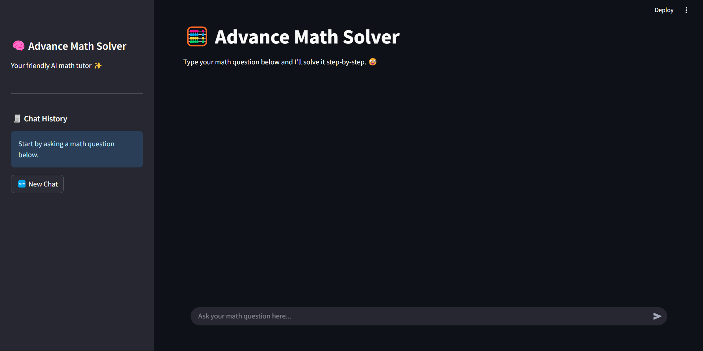

# 📘 EasyStep Math

**EasyStep Math** is a friendly AI-powered math assistant built with Streamlit and Langchain, designed to help users solve math problems step-by-step with clear explanations and LaTeX formatting.
/n test app here :- https://advance-math-solver-ritesh.streamlit.app/

---

## 🚀 Features
- 🧠 LLM-based conversational math solver (uses Groq's LLaMA-3)
- 🧾 Maintains chat history in sidebar
- 💬 Clean dark UI with colored user/assistant chat bubbles
- 🔄 New Chat reset button
- 📐 Supports math input in natural language or symbolic form

---

## 🛠️ Tech Stack
- [Streamlit](https://streamlit.io/) – Frontend UI
- [LangChain](https://www.langchain.com/) – LLM interface
- [Groq API](https://console.groq.com/) – Fast and efficient inference with LLaMA-3
- [Plotly](https://plotly.com/python/) – Graphing support (optional)
- Python libraries: `sympy`, `numpy`

---

## 📦 Installation

1. **Clone the repo**:
```bash
git clone https://github.com/your-username/EasyStep-Math.git
cd EasyStep-Math
```

2. **Install dependencies**:
```bash
pip install -r requirements.txt
```

3. **Set up Groq API Key**:
Open `app.py` and set your key:
```python
GROQ_API_KEY = "your_groq_api_key_here"
```

4. **Run the app**:
```bash
streamlit run app.py
```

---

## 📸 Screenshots



---

## ✏️ Usage
Just type your math question into the chat box and the assistant will reply with a clear step-by-step solution. Use the **New Chat** button to reset.

---

## 🧠 Example Prompts
- `Integrate x^2`
- `What's the derivative of sin(x)*e^x?`
- `Solve 2x + 5 = 11`
- `Plot x^2 from -10 to 10`

---

## 🙌 Credits
Created by Ritesh Chougule ✨

---

## 📄 License
This project is open-source and available under the [MIT License](LICENSE).

